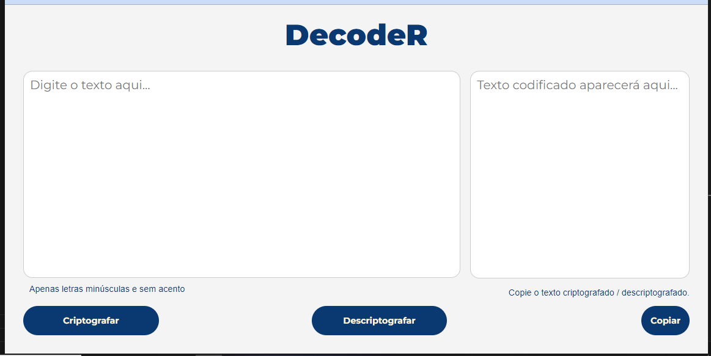
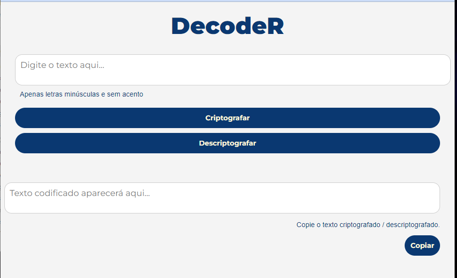
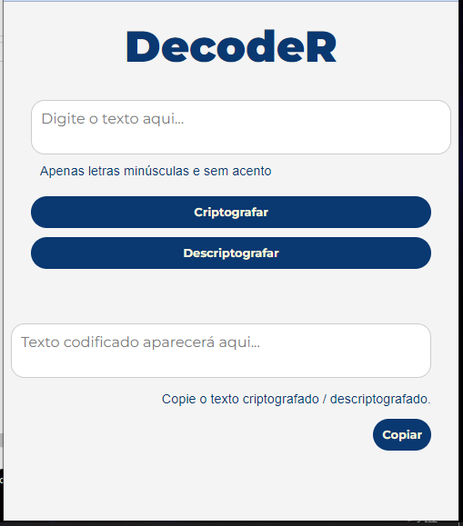

Aqui, relatarei, brevemente, alguns dos processos utilizados na resolução do Challenge:

O HTML do projeto do Challenge fornece a estrutura da página com caixas de texto e botões. O CSS estiliza esses elementos, enquanto o JavaScript trabalha com a lógica de criptografia, descriptografia e cópia de texto e processa as funções. 

O HTML:
<!DOCTYPE html>
<html lang="pt-BR">
<head>
    <meta charset="UTF-8">
    <meta name="viewport" content="width=device-width, initial-scale=1.0">
    <title>DecodeR</title>
    <link rel="stylesheet" href="style.css">
</head>
<body>
    <main class="painel-principal">
        <section class="titulo">
            <h1>DecodeR</h1>
        </section>
        <section class="conteudo">
            <section class="conteudo-esquerda">
                <textarea id="input-text" placeholder="Digite o texto aqui..."></textarea>
                
Apenas letras minúsculas e sem acento

                

                    <button id="encrypt-button">Criptografar</button>
                    <button id="decrypt-button">Descriptografar</button>
                

            </section>
            
            <section class="conteudo-direita">
                <textarea id="output-text" readonly placeholder="Texto codificado aparecerá aqui..."></textarea>
                
Copie o texto criptografado / descriptografado.
 <!-- Aviso na caixa da direita -->
                <button id="copy-button">Copiar</button>
            </section>
        </section>
    </main>
    
</body>
</html>

Explicação do HTML:

Logo de inicio a main recebe um atributo class e é renomeada "painel-principal", isso ajuda a manipulação de todo o conjunto de elementos em momento oportuno: <main class="painel-principal">

Dentro da main são criadas "section" com o objetivo de compartimentalizar e separar os elementos seguintes: <section class="titulo"> (que comporta o título DecodeR) , <section class="conteudo">(que comportar as sections 'conteudo esquerda' e 'conteudo-direita') , <section class="conteudo-esquerda"> (que comporta a caixa de inserção do texto a ser criptografado, além dos botões abaixo dela, 'Criptografar' e 'Descriptografar'), <section class="conteudo-direita"> (que comporta a caixa de texto, que somente mostra o texto criptografado, além do botão 'Copiar').

As id's "input-text" da  caixa de texto de entrada, "output-text" da caixa de texto que mostra o texto criptografado, id="encrypt-button" e "decrypt-button" que correspondem, respectivamente, aos botões 'Criptografar' e 'Descriptografar'. Também a id "copy-button" referentes ao botão 'Copiar'. Essas id's são utilizadas como parâmetros para pegar os valores que são processados nas funções de criptografia, descriptografia e cópia. A imagem a seguir mostra a tela com todos esses elementos.

Implementação do @media para inclusão de responsividade

A implementação do media queries segue o código abaixo:

/* Media query para telas menores que 1200px */
@media (max-width: 1200px) {
    .conteudo {
        gap: 40px; /* Reduz o espaçamento entre as seções */
    }

    .conteudo-esquerda, .conteudo-direita {
        padding: 10px; /* Reduz o padding */
    }

    .container-botao {
        gap: 250px; /* Reduz o espaçamento entre os botões */
    }

    textarea {
        font-size: 1.25rem; /* Reduz o tamanho da fonte das caixas de texto */
    }

    button {
        font-size: 0.9rem; /* Reduz o tamanho da fonte dos botões */
        padding: 15px; /* Ajusta o padding dos botões */
    }
}

/* Media query para telas menores que 992px */
@media (max-width: 992px) {
    .conteudo {
        flex-direction: column; /* Muda para coluna em telas menores */
        height: auto; /* Ajusta a altura automaticamente */
        gap: 20px; /* Reduz o espaçamento entre as seções */
    }

    .conteudo-esquerda, .conteudo-direita {
        width: 100%; /* Define largura total para cada seção */
    }

    .container-botao {
        flex-direction: column; /* Alinha os botões em coluna */
        gap: 10px; /* Reduz o espaçamento entre os botões */
    }

    .conteudo-esquerda {
        margin-bottom: 20px; /* Adiciona margem inferior para separação */
    }

    textarea {
        font-size: 1.1rem; /* Ajusta o tamanho da fonte das caixas de texto */
    }

    button {
        font-size: 0.9rem; /* Reduz o tamanho da fonte dos botões */
        padding: 12px; /* Ajusta o padding dos botões */
    }
}

/* Media query para telas menores que 768px */
@media (max-width: 768px) {
    .conteudo {
        flex-direction: column; /* Continua coluna em telas menores */
        height: auto; /* Ajusta a altura automaticamente */
    }

    .conteudo-esquerda, .conteudo-direita {
        width: 100%; /* Define largura total para cada seção */
    }

    .container-botao {
        flex-direction: column; /* Alinha os botões em coluna */
        gap: 10px; /* Reduz o espaçamento entre os botões */
    }

    textarea {
        font-size: 1rem; /* Ajusta o tamanho da fonte das caixas de texto */
    }

    button {
        font-size: 0.8rem; /* Reduz o tamanho da fonte dos botões */
        padding: 10px; /* Ajusta o padding dos botões */
    }
}

Funções de Criptografia, Descriptografia e Copiar (o texto criptografado):

A função de criptografia entra em ação quando o botão 'Criptografia' é clicado.

function criptografar(texto) {
    return texto
        .replace(/e/g, 'enter')
        .replace(/i/g, 'imes')
        .replace(/a/g, 'ai')
        .replace(/o/g, 'ober')
        .replace(/u/g, 'ufat');
}

E inicia o processamento do texto por meio de outra função:

// Função para Processar Criptografia
function processarTexto() {
    const textoInput = document.getElementById('input-text').value;
    const textoCriptografado = criptografar(textoInput);
    document.getElementById('output-text').value = textoCriptografado;
}

A função de descriptografia entra em ação quando o botão 'Descriptografia' é clicado.

// Função de Descriptografia
function descriptografar(texto) {
    return texto
        .replace(/enter/g, 'e')
        .replace(/imes/g, 'i')
        .replace(/ai/g, 'a')
        .replace(/ober/g, 'o')
        .replace(/ufat/g, 'u');
}

E inicia o processamento da descriptografia do texto por meio de outra função:

// Função para Processar Descriptografia
function processarDescriptografia() {
    const textoInput = document.getElementById('output-text').value;
    const textoDescriptografado = descriptografar(textoInput);
    document.getElementById('output-text').value = textoDescriptografado;
}

A função de copiar texto entra em ação quando o botão 'Copiar' é clicado: 

// Função para Copiar Texto
function copiarTexto() {
    const textoOutput = document.getElementById('output-text');
    textoOutput.select(); // Seleciona o texto na caixa de texto
    document.execCommand('copy'); // Copia o texto selecionado para a área de transferência
}

Os botões funcionam por meio dos 'addEventListener'

// Adicionar Eventos aos Botões
document.getElementById('encrypt-button').addEventListener('click', processarTexto);
document.getElementById('decrypt-button').addEventListener('click', processarDescriptografia);
document.getElementById('copy-button').addEventListener('click', copiarTexto);

